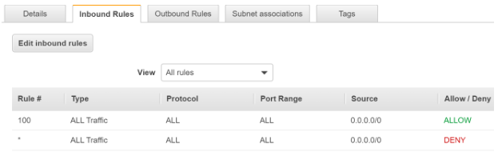
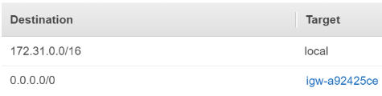
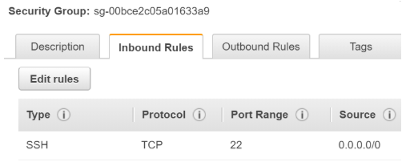

# AWS - More in-depth

## EC2
Using a hypervisor software installed on these bare metal servers, it’s possible to place instances on the bare metal server. The hypervisor is responsible for managing the instances running on the bare metal server, isolating the instances from one another - you don’t want the instance of some other individual to have access to the memory/hdd/etc. of your instance. The hypervisor also distributes the physical resources (RAM, CPU, HDD) to the instances.

An instance can run Windows or Linux operating system. You can connect to the instance the same way you can connect to any other actual server - e.g. with SSH or RDP. When creating an instance you must specify a key to be used when connecting to the instance. If you lose the key  file it’s [difficult](https://aws.amazon.com/premiumsupport/knowledge-center/recover-access-lost-key-pair/) to connect to the instance.

There are different types of instances. What distinguishes the different types is the amount of processing capacity, memory, disk space & networking performance. 
Here’s a very [handy](https://www.ec2instances.info) page that lists all AWS EC2 instance types. The least powerful instance has 2 vCPU, 0.5GB memory and costs you ~3.7$ per month. The powerful ones can have terabytes of ram, hundreds of vCPUs and can cost you 10k-20k$ per month. 

An example instance type name is t3.micro. The types of instances are grouped in instance families [[reference](https://stackoverflow.com/a/48235747)] - e.g. m5, t3, etc. The letter (e.g. “t”) marks the family and the number (e.g. 3) - the generation. The family is what the instances are optimised for, the generation - the “iterations” over this family (e.g. each generation brings improvements). The last part of the name is the size of the instance within the family - nano, micro, small, large, etc.
* General Purpose – (T2, M4, M3)
* Compute Optimized – (C4, C3)
* Memory Optimized – (X1, R4, R3)
* Accelerated Computing (P2, G3, F1) 
* Storage Optimized – (I3, D2)

Just so that you are aware of it, there are different ways AWS can charge you for EC2.
* On-demand - the simplest one. You start an instance and you pay for the duration of when the instance is in running state. If you stop the instance or you terminate it, you don’t pay for it. (stop means that you shut it down, but can later start it again. terminating it completely deletes the instance)
* Reserved - you can prepay compute capacity. E,g, if you know that you’ll definitely need 5 servers in production running all the time, you can pre-pay them. This gives you significantly better price. E.g. on demand m5.12xlarge would cost you 1681$ per month, but if you reserve it, it will be 1074$. You can make a reservation for a 1 or a 3 year period. You can have a full, partial or no upfront payment - the difference is with the discount you get.
* Spot - you bid on a price for the instance that you are willing to pay. If the “spot” price is lower than your bid, you can run the instance. Once your bid is lower than the spot price, AWS will terminate your instance. Useful for cheap processing of heavy workload where it’s not crucial for the processing to finish that quickly and the processing can handle the lost of machines.

## EBS
Elastic Block Storage. Think of it as a virtual hard drive that you can attach to an instance. You can mount this drive in your operating system and use it as any other mounted drive - you can have filesystem on it and write files, install applications, etc.
There are different types of EBS drives based on their performance (throughput) and price. The size of an EBS drive is from 1GB to 16 TB. The size of the drive relates to it performance - the bigger the faster. 
You can attach a drive to an instance, then detach it and attach it to another instance. You can create (automated) snapshots of EBS drives so that in some emergency situation you can restore the state of an instance. The snapshots are stored on S3 under the hood.
## AMI
Amazon Machine Image. Similar to an “.iso” that you can use to launch a virtual machine with, say, Virtual Box.
You can use such an image to launch an instance that already has configuration and programs packaged in. There’s even a marketplace where you can browse (and purchase) a huge variety of AMIs with different software pre-installed. You can use an AMI as a blueprint to launch an instance. 
You can also create an AMI image from an existing instance. E.g. you can launch a barebone Ubuntu instance, configure it, install software, etc., make an AMI from the instance. This way you can launch other instances using the AMI you’ve made so that you don’t need to configure the new instances again. The resulting AMI is called a “golden image” - you make one stable instance (golden) and preserve it in an AMI for later usage. 
## Elastic Load Balancing
The concept of load balancing is extremely important in the context of modern applications. The idea is that you want to spread the load (e.g. web requests) across more than one servers. Your clients are given the address of the load balancer (LB) and make their requests against the LB. The LB would then forward the request to one of the available servers. This way the load is distributed and more requests can be handled.
ELB is a service that lets you load balance traffic to EC2 instances (can also forward traffic to Lambdas). 

There are several types of load balancers - Application, Network and Classic. 
The Classic is the old one and we won’t discuss it here.  
The Application one works on the 7th OSI level - i.e. it understands HTTP.  
The Network one works on the 4th OSI level.  

Every LB has targets -  the instances to which it is forwarding traffic. The Application ELB can forward traffic to different instances based on the URL path (e.g. send /order requests to one set of servers and /profile/<user> to another set of servers). These set of servers are called Target Groups.

The Network ELB uses TCP/UDP connections to forward traffic to its targets, 
## Launch Configuration/Template
Very handy functionality. A launch configuration is just a preset from which you can create instances. It contains information such as instance type, networking settings, tags, bootstrap script to be executed upon startup, EBS volumes to be attached, etc., AMI to launch the instance from, the key that you will use to connect to the instance. A launch config contains all the needed information to launch an instance (cf. an AMI which only contains the image of the OS itself - so only what’s inside the instance but no info about the context of the instance within the cloud).
When creating an EC2 instance, you can choose to use a Launch configuration which will be used to create the instance.
## ASG - Auto-Scaling Group
Very, very important functionality.   
With the help of an ASG you can implement a scalable application. Scalable means that it adjust its server count based on demand.  
An ASG groups together a set of EC2 instances that were launched using the same launch configuration. Then you can specify the min, max and desired number of instances that you want to have in this group. Then given the CPU, networking load, etc. of the instances in the group you can scale up or down the number of instances running in the group. This way you can quickly react to spike in your traffic - AWS can automatically launch 10 additional servers if your application is receiving a lot of requests. Also, it can automatically scale down if the traffic goes down.

Another pattern is to set the min, max and desired to the same number - this way you say that you want to maintain the instance count to some specific number. If any of your instances dies, ASG will launch a new one in order to preserve the desired count.
For the above to work Launch Configurations are of vital importance - when creating an instance, a Launch configuration has all the needed details to create the instance. 
An ASG can be configured to receive traffic from a Classic ELB or from a Target group (i.e. from an Application ELB).

It’s possible to temporarily/permanently detach an instance from an ASG. In practice, this is useful because in case of some production problem with the instance, you can stop traffic to it and investigate what’s wrong with the instance.
N.B. It’s possible to mark an instance as “Protected from scale down events”. This way the ASG will never terminate this instance in a scale down event.
### Health Checks
For ASG & ELB to work, they need to know if a given instance should be considered as “healthy”. An instance can be up and running (from the OS point of view) but the actual application within the instance might not be up. A Health Check is a mechanism which we can use to determine if an instance is considered healthy based on our own definition of healthy.
Normally, you’d configure an (http) endpoint on the instance on some port to return some specific content (e.g. to return “i’m alive”). You can then configure a health check to make a (http) request to the instance using the known port and endpoint. If the instance responds within some time to this requests then it’s considered healthy.
In the context of ASGs, if an instance is detected to be unhealthy, it will stop receiving traffic and a new one will be spawn (if needed - e.g. if losing the instance will result in the instance count falling below the desired/minimum instance count). In the context of ELBs, if an instance becomes unhealthy, the ELB will mark it as unavailable and will not forward traffic to it.
## S3
S3 is organized around the notion of buckets and objects. A bucket is like a top-level folder that you own and its name is unique across all amazon accounts (i.e the name for a bucket you choose should not have been used by any other account - `test`, `foo` and `asd` are probably taken :) ).
In a bucket you can put objects. An object can be any file - text file, archive, binary file, movie, etc. etc. The max file size is 5TB.

There’s a flat hierarchy within the bucket - i.e. you put all objects directly under the bucket.  Theoretically you can’t have subfolders within a bucket. Practically, if you name your file some_folder/some_file.txt, if you view it from the S3 console, the UI will show you that the some_file.txt is under the some_folder folder within the bucket. However, the underlying storage system will treat some_folder/some_file.txt just as a file with longer filename.
An example path to a file in a bucket: `s3://progress-bucket/some_subfolder/hello.txt`.
S3 is used to store files. You can’t use it in an EC2 instance to install software on it, etc. Think of it as a remote file storage.

S3 is known to be very durable - the standard storage class has 99.99999999999% (the eleven nines) durability - i.e. it’s extremely unlikely that a file you store on S3 disappears due to a disaster (flood, fire, earthquake). 
There are different storage classes based on your needs. The standard one is very durable and slightly more expensive. You also have the Infrequent Access class - it’s also durable, it’s cheaper but you pay some fee for every request - so it’s good for important files that you know you’ll use rarely.

There’s also the “one zone infrequent access” storage type - it’s less durable and cheaper - good for data which can easily be re-generated if lost.

You can put/get files on S3 in several ways:
* via the UI of AWS (i.e. the “console”)
* via the AWS CLI program - you install it on your terminal and can use a command like  `aws s3 cp my_local_file.txt s3://progress-bucket-2019/my_local_file.txt` this will copy the local file to a bucket on s3. If you reverse the two path arguments (i.e. the s3 path comes first) then the file from s3 will be copied to your local machine (given that it exists :) )
* via programming languages SDKs (software development kit - think of it as a collection of methods that you can readily use in your code).. E.g. boto3 for Python, you can import the AWS’s SDK and use it to interact with, say, S3


## CLI & SDKs
AWS has it’s UI dashboard website (called the AWS Console). You can perform most of the actions through the UI. However if you want to automate a given process you’d want to write a script which executes the actions you need. 

AWS provides a unified HTTP API that you can use. 
Normally using the raw API (i.e. preparing the requests yourself) is a bit more involved - you need to sign the request so that it passes authentication, you need to handle parsing the response yourself, handle any errors yourself, etc.

That’s why AWS has provided us two better options to programmatically access it’s resources. 
### AWS CLI
You can install the AWS CLI on your shell (works on Windows and Linux, it’s actually a python package). You then configure it with your AWS credentials (an access key and secret key which you generate from the UI and can use to communicate with the API without having to type your username/password on each request).
You can communicate with all (reference) services of AWS using the CLI. You can create instances, terminate them, upload files to S3, create users within your account, etc., etc.
### AWS SDKs
There are programming language libraries that are written for different languages that make it easier to use the AWS API. E.g. you have the python boto3 that lets you access the API from within Python:
```
from boto3 import client
ec2_client = client(‘ec2’)
print(ec2_client.describe_instances())
```

The above will print detailed information about your instances in your AWS account.
### Important remark about regions
When using the CLI or an SDK it’s important to specify to which region you want to make your requests. AWS isolates the different regions, thus you need to explicitly say which region you want to use. The same goes when you’re using the UI Console - at the top left you choose the region in which you want to use services.

Depending on your use case, you can just use the region geographically closest to you - e.g. Frankfurt. This way if you are uploading files from your computer or making API requests to AWS, they will be quicker to complete.  
However, it’s possible that the customers of you application are in the USA. Then it will make sense to have your production environment in the USA. 
## IAM
Identity and Access Management. Services in AWS can communicate with each other. The different services expose different functionality - e.g. an EC2 instance can be started, stopped, a S3 bucket can be created, deleted and files can be uploaded/deleted from it. There are also different actors that can call these actions - this actor can be your user or another AWS service (e.g. upload a file from an instance to a S3 bucket). To control who has access to what actions, IAM is used. 
There are several main concepts in IAM.
* User - in an AWS account we can have multiple users. They can be configured to have access to the UI console, to the AWS API or to both. Users have username and password.
* Group - a set of users that are assigned a set of permissions. E.g. the group of developers, the group of QAs, etc.
* Policy - it’s a json-formatted document which specifies permissions. A policy can be attached to a user. The user will then be allowed to perform the actions specified in the policies attached to the user. When a user attempts a given action - e.g. via the AWS CLI start an instance, the credentials of the user will be used to authenticate the user, then IAM will decide if the user is authorized to perform the action by evaluating all the policies that a user has.
    * an example [policy](https://gist.github.com/jorotenev/9f6985ae4dd26ff3f2efd2951c049a66#file-example-policy-json)
        * it allows to stop and start EC2 instances in the eu-west-1 region
        * it also allows to list (“describe”) the instances in any region
    * A policy is a json object with a list of Statements. Each Statement within a policy specifies a resource and the actions which can be performed on this resource. A resource can be an EC2 instance, S3 bucket, etc. Resources are specified by using their ARN. Wildcards are allowed - they can be used in the region, account-id or resource-id part of the ARN. 
    * The statement can either allow the specified action or deny it.
    * When you start writing policies, please read [this](https://docs.aws.amazon.com/IAM/latest/UserGuide/reference_policies_evaluation-logic.html). In a nutshell, all actions are implicitly denied, if there’s an explicit allow then the action is allowed, if there’s an explicit deny - it’s denied.
* Role - it’s a collection of policies. An AWS service or a user can assume this role. For example we can create a role with a set of policies and assign it to an EC2 instance. Assigning a role to an instance is a relative new functionality. Then the EC2 instance can perform the actions defined in the policies of the role. 

A user can temporarily assume a given role (if has permissions to do so) and perform the actions from the policies in the role. 
It’s handy to let another AWS service assume a given role when the AWS service is doing some work for us but we still want to control what access it can have. For example we can use the CodeBuild service to compile and upload our code to S3. We can create a role and let CodeBuild assume it - this way we will only allow it to upload to a specific S3 bucket. In case we make a mistake in the configuration of the CodeBuild build project which attempts to mistakenly upload our code to the wrong bucket, the policy from the role will not permit this.

As mentioned above, a prime example of the benefit of using a role is with EC2 instances. Before it was necessary to create an IAM user with credentials and configure them directly in the instance’s filesystem so that the instance can use the AWS CLI and SDK to call AWS services. That was extra work. Now it’s possible to create a role and when creating the instance, assign the role the instance from, say, the AWS UI. This way the AWS CLI/SDK will automatically pick up the role and use it without us having to set the credentials manually.

Just as a note, there are policies and roles that AWS has already created and we can use them readily. We can also create our own to fit our needs.	 
An example existing policy is the “AdministratorAccess” - a user which has it is allowed to perform all actions on all resources in all regions within the given AWS account. The content of the policy. Normally only the owner of the account and the more senior devops people are given this policy for understandable reasons :)


## VPC
Virtual Private Cloud. The VPC service is used when you need to setup the networking in your cloud infrastructure. It lets you create a network, add subnets to it, define the routes between subnets and between the different VPCs (we call the network created by the VPC service a VPC), configure rules for accessing host within a network/subnet, etc.

EC2 instances operate within the subnets of a VPC. This is handy because you can easily create a tiered network infrastructure where some servers are in a “public” subnet and are accessible from the outside (i.e. from the Internet where your customers are). You can also have EC2s in a private subnet which is not accessible from the internet but only from instances within the public subnet. 
You can create multiple networks and allow “peering” between them. This way you can have logical separation of your resources - e.g. your production servers are in one network, your logging and DevOps servers are in another, etc.

The main benefit of using a VPC is that you can securely isolate your cloud resources. By not exposing all of your infrastructure to the internet you can protect it better.

There are several concepts that you need to understand to use the VPC service.
### VPC
As mentioned, the VPC is an instance of a network. It has a range of IP addresses that can be used to launch EC2 instances within the VPC.
When you create your AWS account, there’s already a default VPC created for you.
To create a VPC you need to:  
 * specify its CIDR (i.e. the range of  IPs of the VPC) - e.g. 10.0.0.0/16 (from 10.0.0.0 to 10.0.255.255). Note that the first four IPs from every VPC subnet are reserved by AWS [[reference](https://docs.aws.amazon.com/vpc/latest/userguide/VPC_Subnets.html)].
 * (side note) in the AWS Console UI there's also a VPC Create Wizard that will set all resources you need - a VPC, a subnet, route table, etc. It's more user friendly than doing it all by yourself.
### Subnet
A VPC has one or more subnets. Each subnet has its own CIDR block of IPs which must also be within the VPC CIDR. A subnet is launched within an Availability Zone. An instance is launched within a single subnet (thus an instance runs in a single AZ).

### Network Access Control List (Network ACL)
A NACL is associated with your VPC. Think of it as the outermost layer of protection of your VPC. In a NACL you specify which inbound/outbound requests are allowed to/from your VPC. 
A NACL has inbound rules, outbound rules and subnet associations.
There’s a default ACL with the the default VPC of your account. Here are the inbound rules of this default ACL:

The above image shows that requests to the subnets within this VPC will be allowed - for all protocols, to all port ranges and from all originating IP ranges. You can add more inbound rules - the Rule # is the precedence of the rule - the smaller the number, the higher precedence it will have.

### Route Table
Every subnet within a VPC must have a Route table. A route table says to where a given network request must be routed. E.g. below all requests to IPs from the CIDR of the subnet are routed to the subnet, all other requests are forwarded to the Internet. Sample route table of the default VPC from my personal AWS account.


### EC2 Security Group
A Security Group (SG) acts as a virtual firewall that can be assigned on an EC2 instance and control the traffic to/from the instance. You can assign more than one security group to an instance. Here’s a sample SG with a single rule:


The above SG says that the EC2 instance which is assigned the SG will accept TCP requests on port 22 from any remote requester. We can add more rules. E.g. we can limit the inbound source IPs via a CIDR to allow requests to the 80 & 443 ports - if the EC2 instance is hosting a web server.

A notable difference between an SG and a Network ACL is that security groups are “stateful” - i.e. if we add an inbound rule for a given port and source, a matching outbound rule will be implicitly created too. 

For comparison, in a Network ACL if you create an inbound rule, an outbound rule will not be created for you. If there’s no inbound entry in an SG, the traffic is implicitly denied. By default all outbound traffic is allowed in an SG.

You can add and remove security groups from an EC2 instance even after the instance was launched.

Security Groups are created in the context of a single VPC - i.e. different VPC networks will have different set of security groups.
## Public, Private & Elastic IPs
An EC2 instance in a VPC has a private IP - it can be used by the rest of the instances in the VPC/subnet to communicate with the instance. Private IPs cannot be used from outside the VPC to communicate with the instance via the Internet.

If an instance should be accessible via the internet (and the Network ACL/SG allow it) it can be assigned a Public IP that can be used from outside the VPC to access the instance. Every new instance receives a new public/private IP when it’s launched (you configure what type of you

An Elastic IP is an IPv4 public IP that you can reserve for your account. If you hold this IP you can reuse it across different EC2 instances (if one instance dies, you can re-assign the Elastic IP to another). This way you can mask failures of instances without your clients knowing.
## AWS Managed VPN
You can set a VPN connection from your office network to your AWS account by using the AWS Managed VPN service.
Why this is handy from practical perspective? You can have a connection from your office computer to all private subnets in your account. Thus, the instances in a private subnet are not accessible via the Internet, but are accessible via your Direct Connect.
## VPC Direct Connect 
Often times you want a dedicated network link between your office network and your AWS infrastructure. Direct Connect lets you establish a secure connection from your office network to a VPC running in the cloud. Similar to a VPN but there’s dedicated connection with a Direct Connect AWS location - from there AWS has their own high-speed connection with its internal infrastructure..
 Such connection is more performant than a simple VPN from a networking perspective.
