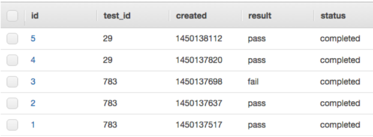

# More AWS Services
## SQS
Simple Queue Service. Queues are an integral part of modern application. Queues enable applications to communicate with each other in a decoupled way - i.e. app A can send a message to app B without app A having to synchronously wait for a response from app B. This way even if app B is temporarily down, it will eventually receive the message from A. For comparison, synchronous inter-application communication can be done via HTTP - app A calls an API of app B and waits for a response. However, if app B is temporarily down, the request of A will fail.

With SQS you can create a queue. One or more clients can send messages to the queue and one or more clients (subscribers) can consume messages from the queue. If one consumer gets a message from the queue, this message is not available for the other consumers.
The message is just a JSON object with a Body key. The value of the Body is some string - e.g. the body can be a serialized JSON object.

The consumer actually performs two actions on the queue when getting a message - first it gets it from the queue and can start processing the contents of the message based on some business logic. Once it’s done processing it deletes the message from the queue. During the time the consumer is processing the message, no other consumer can get this message. However if the consumer which is processing the message fails to finish processing it (e.g. the server dies unexpectedly), then the message will become visible on the queue again for other consumers to get.

Every SQS queue has some configurational attributes that you need to be aware of:
* visibility timeout - how much time a given consumer is allowed to process a message before the message becomes visible in the queue for other consumers.
* retention period - how much time a message can spend in a queue before it expires. SQS is not a storage service, so we don’t want to keep messages for too long
* max receive count - if a given message is sent back (i.e. it’s received by the queue) by the consumer to the queue multiple times it might indicate that the message is unprocessable. If the queue has a Dead Letter Queue (it’s just another queue) configured, then this faulty message will be moved to the Dead Letter Queue. Then we can investigate the contents of the message and see what’s wrong with it. Thus, when a DLQ is configured,  the max retry receive indicates how many times a message can return to its queue before it’s sent to the configured DLQ. Not that if there’s no DLQ configured, the message will stay in the queue until it gets processed or it reaches the retention period of the queue, whichever comes first.

You can send message to a SQS queue from the AWS Console UI, from the AWS CLI or from an SDK.  
SQS can be used for inter-application communication, or to optimize the processing of events - i.e. if one message represents some tasks to be handled, you can span multiple EC2 instances that will all poll the SQS for tasks. This way you can distribute the work between multiple workers to improve the overall processing speed.

## SNS
Simple Notifications Service. In SNS you can create a Topic. A publisher can publish a message to the topic and all of the subscribers of the topic will receive the message.
Upon receiving a message in the topic, it can be forwarded as an email, as an SMS, to an HTTP endpoint, to a  lambda function, etc.  
SNS differs from SQS in that all subscribers will receive all messages.

## RDS
Relational Database Service. Running a database in production is not an easy task. You need to ensure it’s configured properly, it has security patches, it has an appropriate underlying hardware, it’s easy to have backups and it’s easy to restore from these backups. Not an easy task.
In the old days you would set up a bare metal server, provision it with enough hardware resources, then a DB admin will install the database server and someone would need to ensure the database is working correctly and handling the traffic. If the db start receiving too much traffic then scaling horizontally/vertically is NOT an easy task.
Then, people moved to EC2 - managing the hardware was not such a concern, but managing the installation, configuration & patching of the db were still a concern that had to be addressed by the owner of the AWS account. The problem with scaling was also present.

Then RDS was released. It lets you launch a fully managed database with a few clicks - i.e. after it’s initialised you are given a URL, user and password and you can start using it.
There are different supported databases (MySQL, PostgreSQL and Oracle to name a few). It can easily be configured to have read replicas, Horizontal scaling is made simple.
Easy to set scheduled backups. 
It runs on specialised EC2 instances optimised to run a database server on them. 
RDS instances can run in your VPC - you can put them in a subnet accessible only from your backend servers for extra security.

**Multi-AZ RDS Deployment** - you can have a standby replica running in a different Availability Zone from your master node. The replica will receive the updates applied to the master (inserts/deletes/etc.) During a maintenance window or if an AZ is down, RDS will failover to the replica. In a MultiAZ you cannot use the standby replicas as read replicas.  
**Read Replicas** - you can easily setup a db instance to act as a read replica. This way if your application has read queries, it can direct them to the read replica to lower the load on the master node. The db engine’s native asynchronous mechanism is used to propagate the changes from the master node to the read replica.

[RDS Frequently asked questions](https://aws.amazon.com/rds/faqs/)
## DynamoDB
“Amazon DynamoDB is a key-value and document database that delivers single-digit millisecond performance at any scale. It's a fully managed, multiregion, multimaster, durable database with built-in security, backup and restore, and in-memory caching for internet-scale applications.”  [[reference](https://aws.amazon.com/dynamodb/)]

In DynamoDB you can create a Table. A table has its primary key. The rows (i.e. “item”) in the table have attributes (for now you can compare attributes with columns in the SQL world). Each row entry has some type (number, string, etc.).


There are two ways to model your data - with a Primary key or with a Primary key and a Sort key. In the first case the Primary key must be unique in the whole table. In the latter case, the combination  of the Primary & Sort keys must be unique. When using only a primary key, it’s enough to know it to retrieve the unique row from the table. In the second case, you can use the primary key to retrieve a subset of the rows and then use the sort key to order the rows.

An important concept (for a DevOps and as a developer) is the way DynamoDB provisions performance capacity to a Table. There are two main performance configurations a table has - the Read Capacity Units (RCU) and the Write Capacity Units (WCU). These units determine how many read/write operations a table can handle.
1 RCU - 2 read operations per second for rows up to 4kb of size
1 WCU - 1 write operation per second for rows up to 1kb of size

### DynamoDB Capacity Modes
* Provisioned Capacity - You can provision the capacity (RCU & WCU) yourself - you need to determine the load the table will receive and calculate the capacity accordingly. There’s an AutoScaling option available - the table can automatically scale up if there’s more traffic for a given period of time.
* On-demand - (relatively new option) - AWS automatically determines how much capacity your table needs fully transparently - you don’t need to configure the WCU & RCU.

DynamoDB runs by default in a Multi-AZ setup - your data is replicated across multiple AZs within a region.
There’s support for Multi-Region active-active replication - it’s called Global Tables.

If you need to be involved in the design and deployment of a DynamoDB you must understand how data is stored in a table. Please read this if you need to manage a DynamoDB table in production - [[link](https://docs.aws.amazon.com/amazondynamodb/latest/developerguide/HowItWorks.Partitions.html)]

## API Gateway
Imagine you have a web application running on an EC2 instance and it’s exposing some http web API. You can expose it to the world the world so that your clients interact directly with your instance. However this involves some risks and considerations. For example you need to protect it against  DDoS attacks, you need to implement versioning and cache yourself, etc.

API Gateway is a service that lets you define your API endpoint, resources and methods (e.g. /users, POST). You then also configure the backend server that would actually serve the requests. Your clients would then connect to the API Gateway API instead of with your own server. 
In API Gateway you can configure the API Keys that clients need to use to interact with the api. You can have different stages of an API - e.g. production, staging etc. You can change the resources/methods which are public to the world and map them to the one defined in your app.
You can change the payload which the clients send before forwarding it to the your target server.
For a given API resource, you can deploy it to a given stage (you define the stages - prod, stg, etc.). After the stage is deployed it has a URL - your customers can use the URL to make requests. 

You can change the payload forwarded to your target server but you can also change its response before it’s sent back to your client (e.g. add more headers or change the payload itself). This way there’s decoupling between your clients and your application and you have more flexibility to make changes.

API Gateway also supports throttling - e.g. it will block clients that are making abnormally large amount of requests.

Another handy feature is the “Custom domain names”. The URL which you get when you deploy your API is not very user friendly - (`https://<api-id>.execute-api.<region>.amazonaws.com/<stage>`). If you want to present a more user friendly URL to your clients, in API Gateway you can add  a custom domain name (e.g. api.progressbg.net) given that you have access to the DNS entries of progressbg.net. More on the topic here. 

## CloudFront
CloudFront is Amazon’s CDN (content delivery network) solution.
In CF the main entity is called a distribution. A distribution is just target which your clients can hit when they want to get resources from your.   
Here’s an example use case. You have a website which also includes some static files - .css, .js, audio/video clips, etc. If you want you can serve these files straight from your server. However this is inefficient because these files are normally of some size and their contents don’t change often. So you want to offload the task of serving these from your server to CloudFront. This way your server will serve only requests which require some backend logic and not static files which don’t change.  
To do this, you create a distribution, you add your server as an origin of this distribution (e.g. where the content actually is). Then you configure the behaviours - when the distribution receives a HTTP request to `<domain>/static/style.css` then this content will be served from the cache of CloudFront. If the request is to `<domain>/home` then the requests will be forwarded to the origin (i.e. your server) and the server will return a response which will be sent back to the user. This way static content will be served from the cache of CloudFront and the rest from your server. Only the first request to the static file will be forwarded to your origin. In case the static file actually changes (e.g. you have deployed a new version of the css), you invalidate the cache of the distribution.

A handy feature is that in a distribution you can have multiple origins. This way if you want you can store the static files on S3, you can have one origin server handling /home requests and another origin handling requests to /checkout). In the behaviours of the distribution you configure which requests are forwarded to which origins and if caching should be enabled for which server.

Cache on a distribution can be enabled based on the requests path, cookies and headers.

Important remark - each distribution has its URI - e.g. `123asd.cloudfront.net`. When configuring a distribution you need to specify from which domains traffic will be received - e.g. www.progressbg.net & en.progressbg.net. For these domain you create a CNAME DNS entry pointing to the CloudFront URI - this is how you link the domain with the CloudFront distribution.

## Lambda
This is still a very hot service in the cloud world. It is the foundation of the so-called “serverless” movement.  
The idea behind serverless computing is that a company should only be concerned with their application and NOT with managing servers and infrastructure. 
The promise of Lambda is that you only need to supply it the application code and it will run it for you. You don’t need to lose energy on managing servers, only on developing your application.
Behind the scenes, AWS is managing the needed compute infrastructure for you. Your application is executed in a sandboxed environment.  AWS will automatically scale the environment to match your needs - so that your application on Lambda can handle thousands of requests per second without any work from you.  
You pay only for the number of executions of your code - i.e. per request to your code in the lambda.

To create a lambda you only need to provide your code (e.g. Python, Java, .Net, etc.), what is the entrypoint in your code (e.g. the name of the main method), specify the IAM role which your lambda will use to interact with other AWS services, how much memory you need and the maximum execution time after which the lambda will timeout. The lambda is triggered from events. Various AWS services can send an event to the lambda which will trigger it - e.g. a request from API Gateway, message from a SQS topic, message from a SNS topic, etc. 

A lambda function can be configured to run in a VPC - so that it can call resources (EC2 instances) within this VPC.
You cannot specify how much CPU processing power your lambda has, but there’s a correlation between the RAM memory you configure and the CPU power - the more ram, the more CPU power your lambda will have.
You can also test your lambda (e.g. calling it without any triggers) by configuring a test event (JSON payload) and pressing the Test button - the lambda will be passed the JSON you’ve entered.

When developing the code which will run in the Lambda, you need to know the structure of the event that will trigger the lambda - it’s a JSON object.
Lambda can be triggered by a set of services. Here’s a [link](https://docs.aws.amazon.com/lambda/latest/dg/lambda-services.html#eventsources-sqs) with sample events by each service - knowing the structure will make it easier for you to develop the code.

## Route 53
This is the DNS service of AWS. 
Interview hint - it’s 53 because this is the port number on which dns servers operate :)

What you need to know is that you can host the DNS entries for a domain you own in what is called a Hosted Zone - it’s a container of DNS records for a given domain. In a hosted zone you can add DNS entries for the domain. 

Two main things you need to know.
The first one is that there are different routing policies. E.g if we host a website on a given number of servers (one or more), Route 53 enables us to decide how to respond to DNS queries for, say, www.progressbg.net. Following is a *direct quote* from AWS [documentation](https://docs.aws.amazon.com/Route53/latest/DeveloperGuide/routing-policy.html):
* “Simple routing policy – Use for a single resource that performs a given function for your domain, for example, a web server that serves content for the example.com website.”. I.e. the DNS query will just return the IP of our web server
* “Failover routing policy – Use when you want to configure active-passive failover.” I.e. we can have the IPs of two servers - one which is typically responding to web requests, and one failover server that will start receiving traffic when the main one fails to pass its healthchecks
* “Geolocation routing policy – Use when you want to route traffic based on the location of your users.” I.e. we can have servers in multiple regions, and Route 53 will decide which server’s IP to return based on the client’s physical location - e.g. if we have a server in Ireland and America, and our customer is in Bulgaria, then Route 53 will return the IP of the server in Ireland.
* “Geoproximity routing policy – Use when you want to route traffic based on the location of your resources and, optionally, shift traffic from resources in one location to resources in another.” - I.e.  you’re closer to the us-east-1 region than us-west-2 so i’ll route you to us-east-1. You can set a bias to control how strong one region “attracts”.
“bias - e.g. the circle of control for a given region is bigger than some other given it has a higher bias. Handy if, say, the east coast has a higher population of users than the west coast” [[reference](http://acloud.guru) - acloud.guru Solutions Architect Professional Course, Accessed August, 2019]
* “Latency routing policy – Use when you have resources in multiple AWS Regions and you want to route traffic to the region that provides the best latency.”
* “Multivalue answer routing policy – Use when you want Route 53 to respond to DNS queries with up to eight healthy records selected at random.”
* “Weighted routing policy – Use to route traffic to multiple resources in proportions that you specify.”

The second important thing to remember about Route 53:  
ELBs don’t give us their IPs - because they can change. AWS gives  us only the DNS name of the ELB - e.g. `1234567890.us-east-1.elb.amazonaws.com`.  Also, normally an A-type DNS entry contains an IP of a server. In order to add an A record entry for our ELB, Route 53 lets us use the so-called “alias” entry -  we can create an A-record alias entry with the DNS name of the ELB.


## CloudFormation
CloudFormation is a service which lets you create any AWS resources by describing the resources and their configuration in a JSON/YAML file (called a template). With this template you can then create a stack by using CloudFormation. CF will read your template and create the resources defined in the template for you. If you change the template later (add more resources, change the configuration of an existing one, remove a resource from the template), you can update the stack with the new template and CloudFormation will align the resources to match the description from the template file.
This enables you to practice infrastructure-as-a-code. This is useful because you can create resources in a repeatable and stable way, without having to perform the same actions by hand via the UI every time. Since your stack is created by a text template, you can use source control to keep track of the changes in the template. 

As mentioned, you can use JSON or YAML to write your stack templates.
Some of the important sections that you can use in a template are - Resources,Parameters  & Mappings
### Resources
In the Resources section you specify the resources that you need. CloudFormation supports a large subset of AWS services that you can manage via a stack - e.g. EC2, SQS, SNS, etc., etc.
Each resource has a Logical Name (e.g. WebServer), type (e.g. EC2::Instance) and an object with Properties (e.g. Tags, Name, Userdata, etc.).
### Parameters
In the Parameters sections you can define variables that you can use inside the template. For example, in the template you can use a variable called “environment”. You can use this variable in the Resources section - for example if you are naming some resource, you can name it like “<environment>-web-server” - i.e. you use the “environment” parameter. 
When creating/updating the stack, CloudFormation will ask you to give a specific value for this parameter. Based on the value you provide for this parameter, when CloudFormation is processing your template, it will replace the variable in the YAML/JSON with the value of the parameter you have provided a value for. So if you set the “environment” parameter with a value “prod”, when CloudFormation is creating the resource it will name it “prod-web-server”.
This is handy because you can use the same template file, but create different stacks only by using different values of the parameters.
### Intrinsic functions
When you write your template, you can use the so-called intrinsic functions. They are normally used to perform some logic and return some string. When CloudFormation is processing you template file, if it encounters such a function, it will invoke it, get its output and will replace the intrinsic function call in your template with the output of the function invocation. Such a function is used to replace the name of a parameter with the actual value of the parameter specified in the stack.

[Example](https://gist.github.com/jorotenev/9f6985ae4dd26ff3f2efd2951c049a66#file-cloudformation-primer-parameters-yml) with `!Sub` - The sub function will replace the value of the parameter within the string.

Here’re the [docs](https://docs.aws.amazon.com/AWSCloudFormation/latest/UserGuide/intrinsic-function-reference.html) with all intrinsic functions.
### Mappings
Mappings - within the template you can encode some information by using key-value pairs. 
In the resources section, then you can use the key to get the value against this key. 
A common example is to have a mapping based on the environment in which the stack is created (e.g. prod/qa). For each environment a different value might be used for some resource.
To get the value for some key, the !FindInMap intrinsic function is used. [Example](https://gist.github.com/jorotenev/9f6985ae4dd26ff3f2efd2951c049a66#file-cloudformation-primer-mapping-yml) - in this example, given the value of the Environment parameter, a different instance size will be used.


You can validate templates locally via the AWS CLI tool 
`$ aws cloudformation validate-template --template-body=file://<template name here>`


### Practical
#### User credentials & CLI/SDK configuration
As a DevOps you will need to use the AWS CLI and SDKs quite often. 
To do that you need three things - to create an IAM user with credentials, install the CLI or SDK and to configure the CLI/SDK with your credentials.
#### IAM User
You need an AWS account :) From the IAM service, you create a new user with Programmatic access. The IAM user is added Policies with permissions. After the user is created, the Access Key and the Secret key are shown - download the csv with these and save it somewhere safe.

#### Install the CLI/SDK
##### CLI
* [Guide](https://docs.aws.amazon.com/cli/latest/userguide/install-windows.html) - Windows
* [Guide](https://docs.aws.amazon.com/cli/latest/userguide/install-linux.html) - Linux
After you install it, open a new CLI windows and type `aws configure`. Enter the access & secret keys that you’ve previously downloaded. For default region you can specify any AWS region - I normally pick us-east-1 or eu-west-1. us-east-1 is the region which normally receives first any new services. eu-west-1 also receives sooner such new services and is also geographically closer to us.
You can start using the CLI now. Test it with a command like `aws iam list-users`.  
[[commands reference](https://docs.aws.amazon.com/cli/latest/reference/iam/list-users.html)]

To use the CLI you’d typically type `aws`, then the name of the service (e.g. iam, ec2, s3, etc.), then some action available within this service (e.g. list-users, describe-instances, etc.). If the action supports and require it, you might also need to pass some additional arguments arguments.  
For example, when using the `aws ec2 describe-instances` command, we can pass the `--filters` argument in order to receive only the instances that match the filters. E.g. `aws ec2 describe-instances  --filters Name=instance-type,Values=t3.micro` will return only the instances which are of type t3.micro.

##### SDK
I normally use Python when interacting with the AWS API programmatically. The SDK for Python is called boto3
You need to have pip first - pip is the package manager for python.
* [install pip](https://docs.aws.amazon.com/cli/latest/userguide/install-windows.html#awscli-install-windows-pip) - Windows
* [install pip](https://docs.aws.amazon.com/cli/latest/userguide/install-linux.html#install-linux-pip)- Linux

After you have pip, you can use your shell and do `pip install awscli --user` (if pip is not found, try with pip3)

From there, you still need to configure your AWS credentials. Thet are stored in your user's home directory in a folder called `.aws`. If you installed the AWS CLI and ran `aws configure`, you already have the credentials and configuration files under `.aws/`. If not you can create them manually.
### Example usage
In the following example you create an EC2 client and use it to interact with the AWS EC2 API. The code just prints the whole result of the describe_instances() method. However, the result is just a Python dictionary object - you can access values of keys as with any other object.
One thing to note. In the code below we don’t explicitly set the access & secret keys and the region to whose API we want to connect. If we don’t write them explicitly in the Python code, boto3 will look for the credentials and config in the environmental variables with which the script was launched. If there are no env vars set, it will check the  “credentials” and “config” files in the ./aws folder in the user’s home directory (the files set by the “aws configure” command).
```python
from boto3 import client
ec2_client = client('ec2')
print(ec2_client.describe_instances())
```


### Connect to an EC2 instance via SSH with mRemoteNG
You need to start the instance and make sure you have on your computer the key with which the instance was started (e.g. the name of my key is aws2019-eu). You can either first create a key from the EC2 -> Key Pairs page, or if you prefer, create a new key-pair during the configuration of the new EC2 instance. The key is a .pem file that you need to download.
After you have it, you need to convert the .pem file to a .ppk file by using the PuttyGen program (comes with the Putty installation). You then create a mRemoteNG session using the key [link]


### Live Demo AWS Tasks
* Create a CPU alert for an instance which pushes to an SNS topic to which we’ve subscribed
* Convert the homework to a CD pipeline via a Lambda & CodeCommit & CodeBuild
  * host the python code in a codecommit repository
  * on commit, trigger a lambda
  * the lambda starts a codebuild project
  * the codebuild zips the code from the repo and uploads it to our target lambda
  (you need to create the repo, the lambda & the codebuild project)
* Put a bash file on S3 with bootstrap script - it installs apache and writes the hostname of the machine on which the script will rin on to the index.html. Then create a launch configuration with user data which would install pip, awscli (pip install awscli), download the S3 script and execute the s3 bootstrap. The bootstrap will install apache and write the index.html.  It will add a simple html page which prints the hostname. Use the LC to create an autoscaling group with 2/2/2 servers (min/max/desired). Create a load balancer (ALB with a default target group). Hit the LB from your browser - we should see different hostnames. Consider using an IAM instance role for the instances in the ASG with a readonly access.